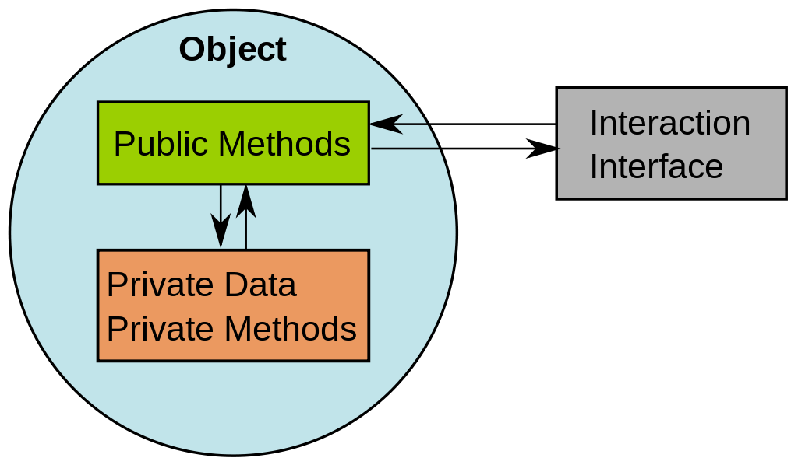
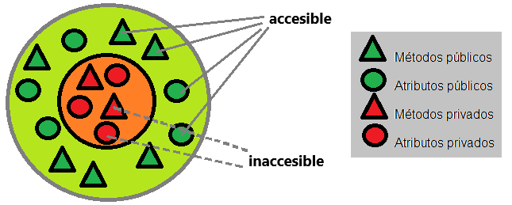
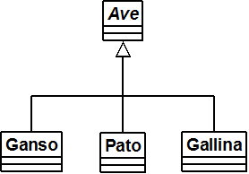
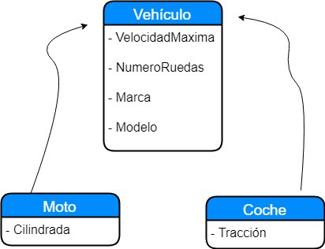

# El paradigma OO
## Paradigma
#### Los paradigmas de programación hacen referencia a las diferentes formas en las que se puede desarrollar un software y, al mismo tiempo, los diversos enfoques sistemáticos que pueden ser aplicados en todos los niveles del diseño de programas, teniendo como finalidad la resolución de problemas relacionados con lo computacional.
## Programación Orientada a Objetos
#### La Programación Orientada a Objetos (POO) es un paradigma de programación, es decir, un modelo o un estilo de programación que nos da unas guías sobre cómo trabajar con él. Se basa en el concepto de clases y objetos. Este tipo de programación se utiliza para estructurar un programa de software en piezas simples y reutilizables de planos de código (clases) para crear instancias individuales de objetos El primer lenguaje orientado a objetos fue SmallTalk creado  por Alan Kay en Xerox PARC.
## Abstracción
#### Podrá decirse que son todas aquellas características específicas de un objeto que lo distinguen de los demás tipos de objetos. Es fundamental pues nos permite crear un modelo general de un objeto , y heredar sus atributos y comportamientos a otros objetos específicos, lo cual nos permite reutilizar el código
## Encapsulamiento
#### La encapsulación es un mecanismo para reunir datos y métodos dentro de una estructura ocultando la implementación del objeto, es decir, impidiendo el acceso a los datos por cualquier medio que no sean los servicios propuestos.En resumen como ejemplo si tienes dos variables con el mismo nombre pero con distinta clase. El método se pone en private para que solo el método tenga acceso a esa variable.

## Herencia
#### La herencia permite que se puedan definir nuevas clases basadas en otra clase con el fin  de heredar las características y atributos de otra clase.

-

